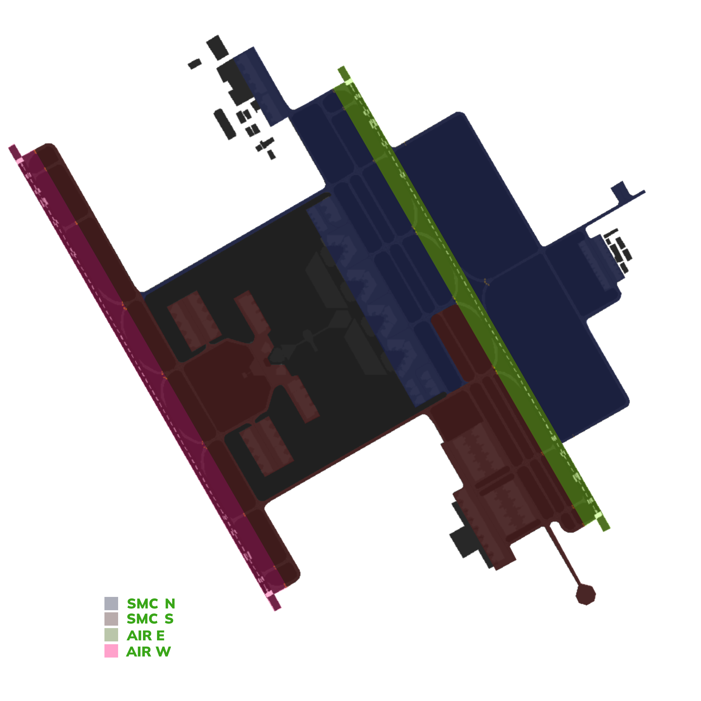
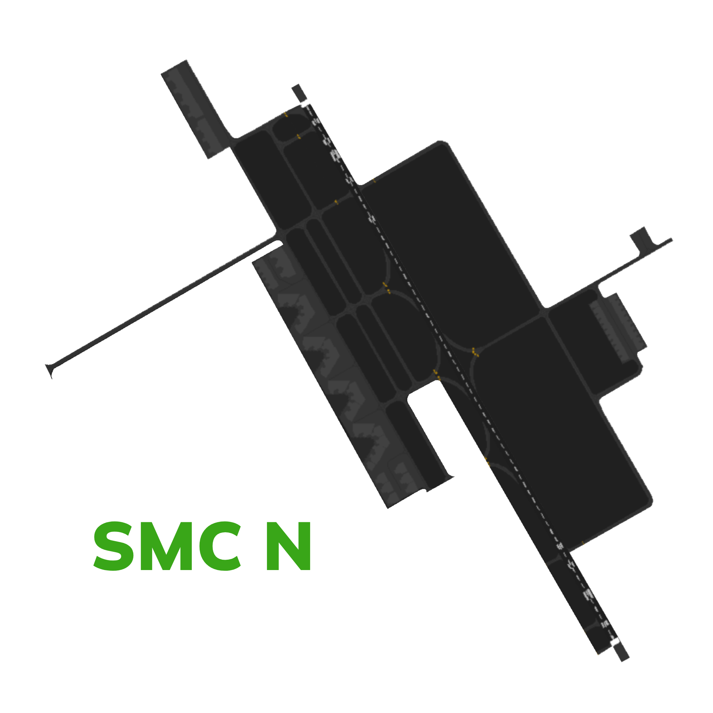
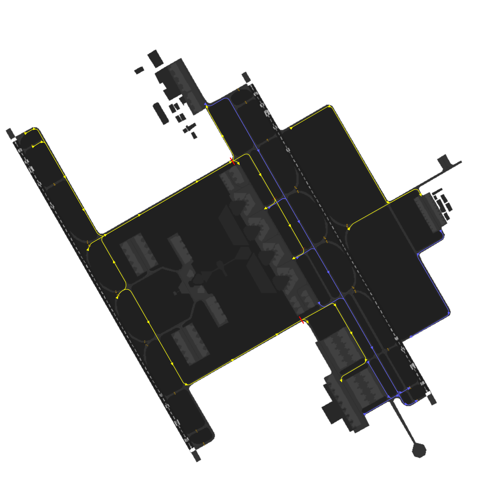

# King Khalid Ground [OERK_X_GND]

!!! success "Covering"
    This section details all the necessary Standard Operating Procedures for Ground Operations in **King Khalid International Airport (OERK)**

---

## 1. General Provisions

King Khalid Ground manages aircraft movements on aerodrome areas, excluding runways and their associated taxiways. Departing aircraft receive pushback and taxi instructions to the runway holding point, while arriving aircraft are assigned a stand and given taxi instructions.

---
## 2. Designated Areas of Responsiblity 
**King Khalid International Airport (OERK)** features two primary Surface Movement Control (SMC) position, namely **SMC N** and **SMC S**. The responsibilities and areas of control for each position are outlined as follows:

### 2.2 SMC N [King Khalid Ground North]

**King Khalid Ground North [OERK_N_GND]** covers northern side of the aerodrome which includes the following aprons and its assoicasted taxiways:

- Cargo Apron
- Apron(s) 1,2,3,4,5 
- General Aviation Apron
- Apron 10

### 2.2 SMC S [King Khalid Ground South]

**King Khalid Ground South [OERK_S_GND]** covers southern side of the aerodrome which includes the following aprons and its assoicasted taxiways:

- Apron 6
- Apron 6, 7, 8, 9

### 2.3 Standard Connection Hierarchy 
Controllers must log in the following order to maintain realism and follow SOPs: 

- SMC N [OERK_N_GND]
- GMP [OERK_DEL]
- SMC S [OERK_S_GND]

 This hierarchy of connection must always be followed unless ATS staff explictly permit you to do otherwise.

---

## 3.  Procedures
The below procedures are considered as standard and no coordination is required to employ them, except where explicitly required.

!!! caution 
    Should a situation arise that does not match any of the below cases, coordinate an arrangement with the affected agencies

### 3.1 Push-back Procedures

Aircraft transferred from the Ground Movement Planner (GMP) should be fully prepared for pushback and have reached their Target Off-Block Time (TOBT). If there are no obstructions, they will be instructed to push back immediately. 

However, if an aircraft requesting pushback is not using the correct transponder code, they must be instructed to squawk the correct code before moving.

Aircraft are issued pushback clearances by the SMC controlling the respective apron that the aircraft is parking at.

The pushback direction is based primarily on aircraft location, runway configuration and the apron's flow direction.

!!! danger "Pushbacks from Aprons 1,2,3,4,5"
    Pushbacks into the alley **ARE NOT** allowed in Riyadh. All pushbacks from Aprons 1,2,3,4,5 should end on **Taxiway E**.

#### 3.1.1  Push-Back Types
##### 3.1.1.1 Standard Push-back
This is the default type of push-back which will normally have the aircraft stop abeam the adjacent stand.

***Phrasesolgy:*** 

> **Pilot:** SVA123, Stand 403, request pushback.

> **GMP:** SVA123, Push & Start Approved, Face South on E.

!!! tip "Be helpful!"
    If you wish to be helpful towards the pilots, you may give them the local QNH. This is not mandatory as the pilot acknowledged the latest ATIS which contains the QNH!

##### 3.1.1.2 Short Push-back
A short pushback instruction shall require the aircraft to complete the pushback abeam the current stand such that the adjacent stand will not be blocked.

***Phrasesolgy:*** 

> **Pilot:** SVA123, Stand 403, requesting pushback.

> **GMP:** SVA123, Short Pushback Approved, Face East.

##### 3.1.1.3 Long Push-back
A long pushback instruction shall require aircraft to complete the pushback operation more then two stands away from where the pushback was commenced. This manoeuvre may be used when an aircraft is vacating a stand to be used by another aircraft that is taxing in.

***Phrasesolgy:*** 

> **Pilot:** SVA123, Stand 403, request pushback.

> **GMP:** SVA123, Long Pushback Approved, Face South on E.

!!! info "Be Specific!"

    If you desire to provide precise instructions regarding the end point of the pushback, you can use the following phraseology to instruct the aircraft to halt at a specific position:

    > **GMP:** SVA123, Long Pushback Approved, Face South on E, Finish Abeam stand XX.

    *or if you wish the aircraft keeps a taxiway clear*

    > **GMP:** SVA123, Long Pushback Approved, Face South on E, Stay Clear of Taxiway XX.

##### 3.1.1.4 Conditional Push-back

In certain situations, conditional pushback instructions may be given when there is an aircraft taxiing behind another aircraft that is waiting for pushback. This ensures safe coordination and efficient movement on the taxiway. This type of pushback is always prefered to be used when applicable as it saves radio time and eases the controller's job.

An example of such an instruction is as follows:

> **Pilot:** SVA123, Stand 403, request pushback.

> **GMP:** SVA123, Behind the Qatari B777 passing from your right to left, push & start approved, face south on E. Behind.

!!! info "Airline"
    When giving the clearance, the "airline" should be mentioned and not "callsign". 

    For example:

    > **GMP:** SVA123, Behind the **Britsh Airways** (~~Speedbird~~) B777 passing from your right to left, push & start approved, face south on E. Behind.

    ---

    In addition, if both aircraft involved in the conditional pushback instruction belong to the same airline, it is common to specify the relationship by saying "Behind the Company B777".

!!! caution "Do note."
    The traffic is only mandated to say "Behind" **once**. The controller is mandated to say it **twice** to ensure the instruction is clear.

##### 3.1.1.5 Simultaneous pushback operations
Simultaneous pushbacks from neighboring stands may be allowed if aircraft are directed using the pushback types described in section 3.1. The aim is to ensure that once both aircraft have completed their pushback procedures, they will be positioned on the taxiway with one stand between them.

---

### 3.2  Taxi Procedures
####  3.2.1  Departure Taxi Procedures
##### 3.2.1.1 33s Departure Taxi Procedures

|       **Apron**      | **Holding Point(s)** | **Apron Exit Taxiway(s)** | **Taxi via** | **Handoff to Tower** |
|:--------------------:|:--------------------:|:-------------------------:|:------------:|:------------------:|
|      **Aprons 2,3,4 & 5** |         G1/G        |          T,R,S         |     T/R/S, G    |     _Passing T_    |
|      **Apron 6**   |         G1/G        |        V/F        |     V/F, G1     |     _Immediate_    |
|      **Apron C**  |         G1/G       |           N           |   N, G     |   _Passing by T_  |
| **Aprons 7 & 9** |        G1/G        |            J/Q           |     A, T, G, G1     |    _Passing T_    |
|      **Apron G**  |         H1        |             H2            |  H2, H, H1 |    _Taxing on H_    |

##### 3.2.1.2 15s Departure Taxi Procedures

|       **Apron**      | **Holding Point(s)** | **Apron Exit Taxiway(s)** | **Taxi via** | **Handoff to Tower** |
|:--------------------:|:--------------------:|:-------------------------:|:------------:|:------------------:|
|      **Aprons 2,3,4 & 5** |         G7/G        |          T,R,S         |     T/R/S, G    |     _Passing P_    |
|      **Apron 6**   |         G7/G        |        V/U        |     V/U, G    |     _Passing P_    |
|      **Apron C**  |         G7/G       |           N           |   N    |  _Immediate_ |
|      **Apron G**  |         H4       |             H3           |  H3, H, H4 |    _Taxing on H_    |

##### 3.2.1.1 33s Departure Taxi Procedures

|      **Type**     |    **Taxi to**   |            **Taxi via**            |   **Initial Taxi By TWR**  |
|:-----------------:|:----------------:|:----------------------------------:|:--------------------------:|
|     **International Airlines**     |      Aprons 2,3,4 & 5   | A, P, E| A, **Hold Short of P** |
|      **Domestic & Lowcost**     |    Apron 6     |  A, T, D| A, **Hold Short of T** |
|     **Royal Aprons**     |      Aprons 7 & 9   |                  A, J/Q               |         N/A        |
|    **Cargo Aprons**   |      Apron C      |  A, P, E| A, **Hold Short of P** |
|    **General Aviation**   |      Apron G     | A, P, H| A, **Hold Short of P** |

##### 3.2.1.2 15s Departure Taxi Procedures

|      **Type**     |    **Taxi to**   |            **Taxi via**            |   **Initial Taxi By TWR**  |
|:-----------------:|:----------------:|:----------------------------------:|:--------------------------:|
|     **International Airlines**     |      Aprons 2,3,4 & 5   | A, P, E| A, **Hold Short of P** |
|      **Domestic & Lowcost**     |    Apron 6     |  A, T, D| A, **Hold Short of T** |
|     **Royal Aprons**     |      Aprons 7 & 9   |                  A, J/Q               |         N/A        |
|    **Cargo Aprons**   |      Apron C      |  A, P, E| A, **Hold Short of P** |

---
#### 3.2.3 Stand Allocation Procedure
Stands are assigned by the GRPlugin in the Euroscope, but controllers should preferably have a basic idea of stand assignments.

| **Aprons** |                         **Airlines**                        |
|:----------------------:|:-----------------------------------------------------------:|
|         Apron 2        |           International Airlines          |
|         Apron 3        | International Airlines (Iraqi, Sun air, Ariana Afghan ) |
|    Apron 4   |                        International Airlines                        |
|       Apron 5      |                            Saudi Airline (International Flights)                             |
|         Apron 6       |                            Domestic & Lowcost (Flynas, Flyadeal, Saudi)                            |
|        Apron 7 & 9        |                   Royal Aprons                   |
|        Apron C        |                          Cargo Flights                           |
|         Apron G        |                       General Aviation                      |

Table 3.2.4 - Stand Allocation Procedure

---

#### 3.2.4 Initial Taxi
**Initial Taxi** is a short pre-coordinated taxi instruction for traffic that is issued by Tower to maintain a smooth flow of traffic after aircraft vacate the runway. These taxi instructions are issued to prevent traffic congestion around the RETs and to optimize the tower's efficiency by avoiding the need to provide initial taxi instructions. Instead, the tower instructs the traffic to taxi initially to an intermidate point and the pilot can contact ground while taxing to get the full clearance. 

This allows for a smooth and immediate transfer of traffic to the appropriate ground controller.

!!! caution Do Note

    The Tower controller is responsible for giving initial taxi instructions to aircraft. However, it is essential for the Ground controller to be familiar with these routes in order to anticipate when transfers from the Tower will occur and to follow the correct handoff procedure. 

    By being familiar with the initial taxi routes, the Ground controller can anticipate the aircraft's movements and facilitate effective communication and coordination during the handoff process between the Tower and Ground controllers.

    It also the ground controller's responsiblity to beware of these ITRs and be cautious when clearing other aircrafts in the path of the ITRs.  

#### 3.2.5  Arrival Taxi Procedures
##### 3.2.5.1 General Arrival Taxi Procedures
SMC 1 should promptly assign a stand to an aircraft as soon as it appears on the arrival list using the stand assigner in the sectorfile . This enables the Tower controller to clear the aircraft to the appropriate vacating point, allowing them to follow the Arrival Taxi Procedures outlined below. 

Upon vacating the runway, the Tower controller will instruct the aircraft to follow an initial taxi route and provide the correct ground frequency for communication. Subsequently, the Ground controller is responsible for providing a taxi route that aligns with the prescribed taxiroutes mentioned below.

##### 3.2.5.2 33s SARO Arrival Taxi Procedures

|      **Type**     |    **Taxi to**   |            **Taxi via**            |   **Initial Taxi By TWR**  |
|:-----------------:|:----------------:|:----------------------------------:|:--------------------------:|
|     **International Airlines**     |      Aprons 2,3,4 & 5   | A, P, E| A, **Hold Short of P** |
|      **Domestic & Lowcost**     |    Apron 6     |  A, T, D| A, **Hold Short of T** |
|     **Royal Aprons**     |      Aprons 7 & 9   |                  A, J/Q               |         N/A        |
|    **Cargo Aprons**   |      Apron C      |  A, P, E| A, **Hold Short of P** |
|    **General Aviation**   |      Apron G     | A, P, H| A, **Hold Short of P** |

##### 3.2.5.2 33s DARO Arrival Taxi Procedures

|      **Type**     |    **Taxi to**   |            **Taxi via**            |   **Initial Taxi By TWR**  |
|:-----------------:|:----------------:|:----------------------------------:|:--------------------------:|
|     **International Airlines**     |      Aprons 2,3,4 & 5   | A, P, E| A, **Hold Short of P** |
|      **Domestic & Lowcost**     |    Apron 6     |  A, T, D| A, **Hold Short of T** |
|     **Royal Aprons**     |      Aprons 7 & 9   |                  A, J/Q               |         N/A        |
|    **Cargo Aprons**   |      Apron C      |  A, P, E| A, **Hold Short of P** |
|    **General Aviation**   |      Apron G     | A, P, H| A, **Hold Short of P** |

##### 3.2.5.3 15s SARO Arrival Taxi Procedures

|      **Type**     |    **Taxi to**   |            **Taxi via**            |   **Initial Taxi By TWR**  |
|:-----------------:|:----------------:|:----------------------------------:|:--------------------------:|
|     **International Airlines**     |      Aprons 2,3,4 & 5   | A, P, E| A, **Hold Short of P** |
|      **Domestic & Lowcost**     |    Apron 6     |  A, T, D| A, **Hold Short of T** |
|     **Royal Aprons**     |      Aprons 7 & 9   |                  A, J/Q               |         N/A        |
|    **Cargo Aprons**   |      Apron C      |  A, P, E| A, **Hold Short of P** |

##### 3.2.5.3 15s DARO Arrival Taxi Procedures

|      **Type**     |    **Taxi to**   |            **Taxi via**            |   **Initial Taxi By TWR**  |
|:-----------------:|:----------------:|:----------------------------------:|:--------------------------:|
|     **International Airlines**     |      Aprons 2,3,4 & 5   | A, P, E| A, **Hold Short of P** |
|      **Domestic & Lowcost**     |    Apron 6     |  A, T, D| A, **Hold Short of T** |
|     **Royal Aprons**     |      Aprons 7 & 9   |                  A, J/Q               |         N/A        |
|    **Cargo Aprons**   |      Apron C      |  A, P, E| A, **Hold Short of P** |

#### 3.2.6  Arrival Taxi Procedures
##### 3.2.6.1 General Arrival Taxi Procedures
SMC 1 should promptly assign a stand to an aircraft as soon as it appears on the arrival list using the stand assigner in the sectorfile . This enables the Tower controller to clear the aircraft to the appropriate vacating point, allowing them to follow the Arrival Taxi Procedures outlined below. 

Upon vacating the runway, the Tower controller will instruct the aircraft to follow an initial taxi route and provide the correct ground frequency for communication. Subsequently, the Ground controller is responsible for providing a taxi route that aligns with the prescribed taxiroutes mentioned below.

##### 3.2.6.2 33s Arrival Taxi Procedures

|      **Type**     |    **Taxi to**   |            **Taxi via**            |   **Initial Taxi By TWR**  |
|:-----------------:|:----------------:|:----------------------------------:|:--------------------------:|
|     **International Airlines**     |      Aprons 2,3,4 & 5   | A, P, E| A, **Hold Short of P** |
|      **Domestic & Lowcost**     |    Apron 6     |  A, T, D| A, **Hold Short of T** |
|     **Royal Aprons**     |      Aprons 7 & 9   |                  A, J/Q               |         N/A        |
|    **Cargo Aprons**   |      Apron C      |  A, P, E| A, **Hold Short of P** |
|    **General Aviation**   |      Apron G     | A, P, H| A, **Hold Short of P** |

##### 3.2.6.3 15s Arrival Taxi Procedures

|      **Type**     |    **Taxi to**   |            **Taxi via**            |   **Initial Taxi By TWR**  |
|:-----------------:|:----------------:|:----------------------------------:|:--------------------------:|
|     **International Airlines**     |      Aprons 2,3,4 & 5   | A, P, E| A, **Hold Short of P** |
|      **Domestic & Lowcost**     |    Apron 6     |  A, T, D| A, **Hold Short of T** |
|     **Royal Aprons**     |      Aprons 7 & 9   |                  A, J/Q               |         N/A        |
|    **Cargo Aprons**   |      Apron C      |  A, P, E| A, **Hold Short of P** |

####  3.2.7 Taxi Diagrams
##### 3.2.7.1 Legend
###### Departures Flow

###### Arrivals Flow

##### 3.2.7.2 33 SARO Config

##### 3.2.7.2 33 DARO Config

##### 3.2.7.3 15 SARO Config

##### 3.2.7.3 15 DARO Config
